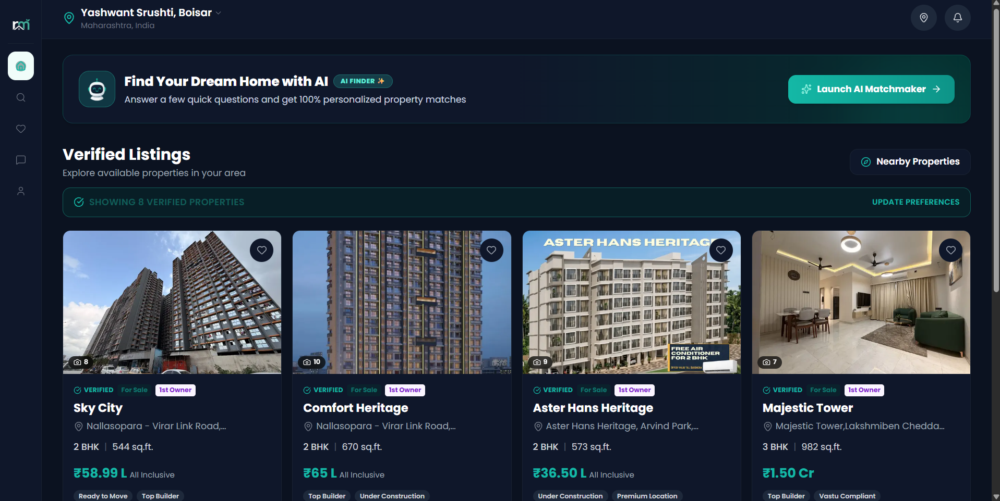
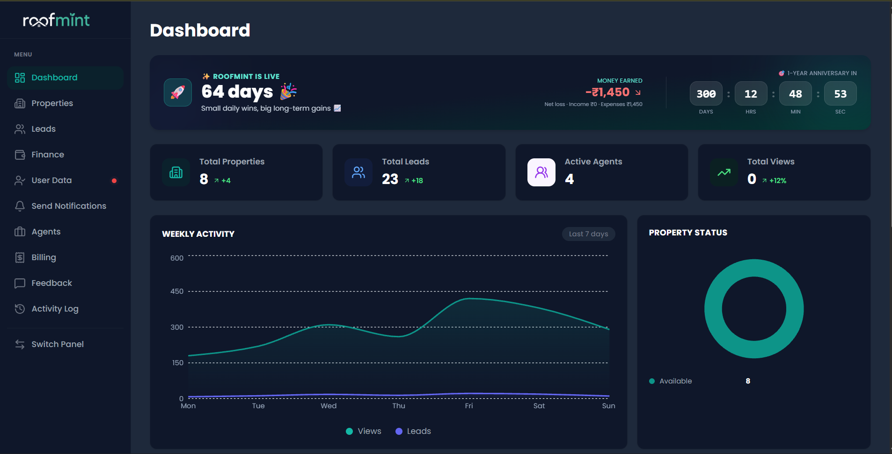

# PRD — Real Estate Lead Generation Platform

## 1. Product Vision
A two-sided real estate marketing platform that helps **agencies/builders/brokers** list properties professionally and convert website traffic into **qualified leads**, while giving **property seekers** a fast, AI-guided, mobile-first way to discover properties that match their intent — without endless manual filtering.

The core value exchange:
- **Broker/Builder side:** get high-intent leads with full context (property + enquirer + confidential agent mapping) in one dashboard.
- **Buyer/Tenant side:** describe what you want in plain language to an AI concierge, get 3–5 accurately matched properties instead of scrolling 200 listings.

## 2. Target Users

| User | Role | Core Need |
|---|---|---|
| **Admin (You / Agency Ops)** | Manages all listings, agents, leads | Full control panel, confidentiality of agent data, clean lead pipeline |
| **Broker / Builder (Lead recipient)** | Indirect user — receives leads via admin | Wants qualified, ready-to-close leads, not spam |
| **Property Seeker (Buyer/Tenant/Investor)** | End consumer on public site | Wants fast, relevant, low-effort discovery + trust signals (photos, videos, RERA, verified) |

## 3. Problem Statement
Most local real estate sites are either (a) static brochures with no lead intelligence, or (b) generic portals (99acres/MagicBricks/Housing) where individual brokers/builders get buried and can't control branding or lead quality. There's no lightweight, brandable, AI-assisted listing + lead engine built for a single agency managing multiple builder/broker relationships.

## 4. Goals & Success Metrics

| Goal | Metric |
|---|---|
| Convert visitors → enquiries | Enquiry conversion rate (target >4-5% of sessions) |
| Speed to lead handoff | Time from enquiry submitted → visible in admin lead panel (< 1 min, real-time) |
| Match quality | % of AI-suggested properties that get a "view details" click |
| Agent/lead confidentiality | Zero agent PII leakage to public/client-side |
| Mobile usability | >70% of traffic mobile, bounce rate < 40% on property detail pages |
| Repeat engagement | % of users who star a property or return within 7 days |

## 5. Feature Set

### 5.1 Admin Panel (internal, authenticated, role-based)
- **Property CRUD**
  - Images (multi-upload, reorder, cover image), videos (upload or YouTube/Instagram embed links)
  - Location (address + map pin/geocode), carpet area, built-up area, price, price type (fixed/negotiable/starting from)
  - Nearby places (schools, hospitals, metro, highway — tagged categories with distance)
  - Property demand tag (Hot / Moderate / Low) — manually set or auto-derived from enquiry volume
  - Amenities (checklist + custom add: gym, pool, parking, power backup, security, clubhouse, etc.)
  - Property type (Apartment/Villa/Plot/Commercial/Office), BHK config, furnishing status
  - RERA registration number (India-specific trust signal)
  - Status toggle: **Available / Sold / On Hold / Coming Soon**
- **Agent Management (confidential)**
  - Agent/broker/builder name, phone, email, company, commission notes
  - **Visible only to Admin role** — never exposed via public API/client bundle (enforced at DB row-level security, not just UI hiding)
  - Each property mapped to one primary agent (+ optional co-agent)
- **Enquiry / Lead Management**
  - Table view: Property details | Enquirer details (name, phone, email, message, budget) | Mapped agent details | Timestamp | Status
  - Lead status pipeline: **New → Contacted → Follow-up → Site Visit Scheduled → Closed-Won → Closed-Lost** (not just a flag — brokers need this for CRM hygiene)
  - Filter/search by property, agent, date range, status
  - Export to CSV / push to WhatsApp / email digest to broker
- **Dashboard/Analytics**
  - Views per property, enquiry-to-view ratio, top-performing properties, lead source breakdown
- **Admin activity log** (who changed what status, when — accountability if multiple admins)

### 5.2 Client-Facing Website (public, mobile-first)
- **AI Chatbot-first discovery (landing experience)**
  - Conversational intake: budget range, preferred location(s), BHK/type, must-have amenities, purpose (self-use/investment/rental)
  - Renders as interactive **cards** during conversation (quick-select chips for location, price slider, property type icons) — not just free text, to reduce typing friction on mobile
  - AI parses intent → applies structured filters → ranks/sorts inventory → returns top matches with a short "why this matches" explanation
  - Fallback: users can skip chat and go straight to manual filter/search browse mode
- **Property Listing & Detail Pages**
  - Grid/list view with cover image, price, location, BHK, status badge
  - Detail page: photo gallery (lightbox), embedded videos/YouTube, map with nearby places, amenities grid, price & area breakdown, similar properties carousel
  - "Enquire Now" → opens short form (name, phone, email, message) → on submit shows confirmation: *"Thanks! Our team will reach out within 24 hours."*
- **User Account Features**
  - OAuth login (Google, optionally Apple) via Supabase Auth
  - Profile page (saved searches, contact prefs)
  - **Starred/Wishlist properties**
  - **Notifications** — price drop on starred property, status change (e.g., "Sold" on a starred property), new property matching saved search
  - Dark mode (system-aware + manual toggle)
- **Trust & Conversion Elements**
  - RERA badge, verified listing badge, testimonials section, "X people enquired this week" (demand signal — only if real, never fabricated)

## 6. Key User Stories
- As a **property seeker**, I tell the chatbot my budget and area once, and I don't have to manually apply 6 filters.
- As a **property seeker**, I can star a property and get notified if its price drops or it's marked sold.
- As an **admin**, I can see exactly which agent a lead should go to without that agent's info ever being public.
- As an **admin**, I can mark a property "Sold" in two taps and it disappears from active search but stays in history.
- As a **broker**, I receive a clean lead packet (property + buyer intent + contact) instead of a raw phone number with no context.

## 7. Non-Functional Requirements
- Mobile-first responsive design (design at 375px width first)
- Page load < 2.5s on 4G for listing pages (image optimization, lazy load, CDN)
- Row-Level Security on Supabase for agent-confidential data and per-user starred/profile data
- Enquiry form spam protection (rate limiting + honeypot/captcha)
- SEO: server-rendered/ISR property detail pages, structured data (schema.org RealEstateListing), clean slugs
- Accessibility: WCAG AA color contrast, especially given dark mode

## 8. Out of Scope (v1)
- Payment/booking-token collection (leads only, not transactions)
- Full CRM (kept as a clean lead export/integration point instead)
- Multi-tenant white-label for other agencies (single-agency v1)

## Screenshots




# ARCHITECTURE — Real Estate Lead Generation Platform

## 1. Tech Stack

| Layer | Choice | Notes |
|---|---|---|
| Frontend framework | Next.js 14 (App Router) | Client site + Admin panel as separate route groups or separate app |
| Styling | Tailwind CSS + shadcn/ui | Fast, consistent design tokens; dark mode via `class` strategy |
| Animation | Framer Motion | Chat card transitions, page transitions |
| Backend/DB | Supabase (Postgres + Auth + Storage + Row Level Security) | Single source of truth, avoids a separate FastAPI unless AI logic gets heavy |
| Auth | Supabase Auth — Google OAuth for users, email/password (or magic link) for Admin | Roles enforced via `profiles.role` + RLS |
| Media storage | Supabase Storage (images/video thumbnails) + YouTube/Instagram embeds by URL (no re-hosting large video) | Keep raw video hosting off your infra cost |
| AI Chatbot | Claude API (Anthropic) via server route, tool-use/function-calling to emit structured filter JSON | Server-side only — never expose API key client-side |
| Notifications | Supabase Realtime / Edge Functions + Web Push (or simple in-app + email via Resend) | WhatsApp via WhatsApp Business Cloud API (Phase 2+) |
| Hosting | Vercel (Next.js) + Supabase Cloud | Matches your existing stack pattern (Qubitern, EkaFlow) |
| Maps | Mapbox or Google Maps Embed API | For location pin + nearby places |

> Note: A separate FastAPI service is optional. Recommend starting with Next.js API routes + Supabase directly — add FastAPI only if you need heavier server-side AI orchestration later (e.g. batch demand scoring, scraping comps).

## 2. High-Level System Flow

```
                          ┌────────────────────┐
                          │   Admin Panel (Next)│
                          │  /admin/*  (RBAC)   │
                          └─────────┬───────────┘
                                    │ CRUD (RLS: admin only)
                                    ▼
        ┌──────────────────────────────────────────────┐
        │                Supabase (Postgres)             │
        │  properties · agents · media · enquiries        │
        │  users/profiles · starred · notifications        │
        └───────────────┬─────────────────┬──────────────┘
                         │                 │
        Public read (RLS: no agent data)   │ Realtime insert
                         ▼                 ▼
        ┌───────────────────────┐  ┌──────────────────────┐
        │  Client Website (Next) │  │  Admin Lead Inbox      │
        │  AI Chat → Filters →   │  │  (realtime new leads)  │
        │  Listings → Detail →   │  └──────────────────────┘
        │  Enquiry Form          │
        └───────────┬────────────┘
                     │ tool-call (server route)
                     ▼
        ┌───────────────────────┐
        │  Claude API (chatbot)  │
        │  extracts structured   │
        │  filters from chat     │
        └───────────────────────┘
```

## 3. Database Schema (Supabase / Postgres)

```sql
-- USERS / PROFILES
profiles (
  id uuid pk references auth.users,
  full_name text,
  avatar_url text,
  role text check (role in ('admin','user')) default 'user',
  phone text,
  created_at timestamptz default now()
)

-- AGENTS (CONFIDENTIAL — admin-only RLS)
agents (
  id uuid pk default gen_random_uuid(),
  name text not null,
  phone text,
  email text,
  company text,
  commission_notes text,
  created_at timestamptz default now()
)

-- PROPERTIES
properties (
  id uuid pk default gen_random_uuid(),
  title text not null,
  slug text unique not null,
  description text,
  property_type text, -- Apartment/Villa/Plot/Commercial/Office
  bhk int,
  furnishing text, -- Unfurnished/Semi/Full
  carpet_area numeric,
  built_up_area numeric,
  price numeric not null,
  price_type text, -- fixed/negotiable/starting_from
  location_address text,
  latitude numeric,
  longitude numeric,
  rera_number text,
  demand_tag text default 'moderate', -- hot/moderate/low
  status text default 'available', -- available/sold/on_hold/coming_soon
  primary_agent_id uuid references agents(id),
  co_agent_id uuid references agents(id),
  views_count int default 0,
  created_at timestamptz default now(),
  updated_at timestamptz default now()
)

-- MEDIA
property_media (
  id uuid pk default gen_random_uuid(),
  property_id uuid references properties(id) on delete cascade,
  media_type text, -- image/video_youtube/video_instagram/video_upload
  url text not null,
  is_cover boolean default false,
  sort_order int default 0
)

-- AMENITIES (many-to-many)
amenities (id uuid pk, name text unique)
property_amenities (property_id uuid references properties(id), amenity_id uuid references amenities(id))

-- NEARBY PLACES
nearby_places (
  id uuid pk default gen_random_uuid(),
  property_id uuid references properties(id) on delete cascade,
  category text, -- school/hospital/metro/highway/mall
  name text,
  distance_km numeric
)

-- ENQUIRIES / LEADS
enquiries (
  id uuid pk default gen_random_uuid(),
  property_id uuid references properties(id),
  user_id uuid references profiles(id), -- nullable if guest enquiry
  name text not null,
  phone text not null,
  email text,
  message text,
  budget_hint text,
  status text default 'new', -- new/contacted/follow_up/site_visit/closed_won/closed_lost
  created_at timestamptz default now()
)

-- STARRED / WISHLIST
starred_properties (
  user_id uuid references profiles(id),
  property_id uuid references properties(id),
  created_at timestamptz default now(),
  primary key (user_id, property_id)
)

-- NOTIFICATIONS
notifications (
  id uuid pk default gen_random_uuid(),
  user_id uuid references profiles(id),
  type text, -- price_drop/status_change/new_match
  property_id uuid references properties(id),
  message text,
  is_read boolean default false,
  created_at timestamptz default now()
)

-- SAVED SEARCHES (for "new match" notifications)
saved_searches (
  id uuid pk default gen_random_uuid(),
  user_id uuid references profiles(id),
  filters jsonb, -- {budget_min, budget_max, location, bhk, type...}
  created_at timestamptz default now()
)

-- ADMIN ACTIVITY LOG
activity_log (
  id uuid pk default gen_random_uuid(),
  admin_id uuid references profiles(id),
  action text,
  entity_type text,
  entity_id uuid,
  created_at timestamptz default now()
)
```

### Row-Level Security (critical)
- `agents` table: **no public SELECT policy at all** — only accessible via service-role in admin server routes. Client bundle never queries this table directly.
- `properties`, `property_media`, `amenities`, `nearby_places`: public SELECT allowed, but any join to `agents` happens server-side only, stripped before response.
- `enquiries`: INSERT allowed for anyone (rate-limited); SELECT restricted to `role = 'admin'`.
- `starred_properties`, `notifications`, `saved_searches`: user can only access rows where `user_id = auth.uid()`.

## 4. AI Chatbot Architecture
1. User chats → message sent to a Next.js server route (`/api/chat`).
2. Server route calls Claude API with a system prompt defining a **tool** like `extract_filters(budget_min, budget_max, location, bhk, property_type, must_have_amenities, purpose)`.
3. Claude either asks a clarifying question (returned as text + suggested quick-reply chips) or calls the tool once it has enough signal.
4. On tool call, server runs a Postgres query against `properties` using the extracted filters, ranks by relevance + demand_tag + recency, returns top 5–8.
5. Frontend renders results as property cards inside the chat thread, plus a "See all matches" link to full filtered listing view.
6. Conversation state kept client-side (or in a `chat_sessions` table if you want persistence/analytics on what people are searching for — recommended, since it's valuable demand data for the admin dashboard).

## 5. Notifications Flow
- Property status/price change → Postgres trigger or Edge Function checks `starred_properties` and `saved_searches` → inserts row into `notifications` → Supabase Realtime pushes to subscribed client → in-app toast + notification bell badge.
- Optional: nightly Edge Function cron matches `saved_searches` against newly added properties.

## 6. Deployment
- Vercel for Next.js (client + admin, can be same repo with `/admin` route group protected by middleware checking `role=admin`, or split into two Vercel projects for stricter separation).
- Supabase Cloud project (single project, schema separated by RLS, not by DB).
- Environment secrets (Claude API key, Supabase service role key) — server-side only, never in client bundle.
